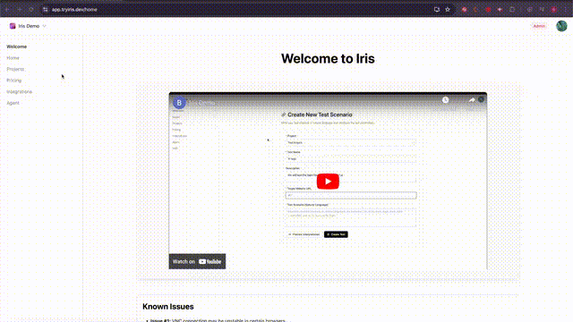
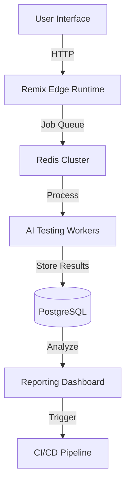

#  Iris

**Revolutionizing Open-Source AI Testing Infrastructure**

While AI-powered backend UI testing solutions have proliferated, developers face a critical challenge: most advanced testing agents are closed-source black boxes. Iris emerges as a transparent, community-driven solution - offering enterprise-grade testing capabilities with complete visibility and control.

[](https://github.com/pokemonlabs/iris) 
[](https://discord.gg/uuNbJQyw6g)


## 🚀 Why Iris?

✅ **Full observability** into testing algorithms and processes  
✅ **Avoid vendor lock-in** with self-hosted AI models  
✅ **Community-driven improvements** through open collaboration  
✅ **Modern testing paradigm** combining AI precision with developer control

## 🌟 Featured Capabilities

- Visual regression testing with AI-powered analysis
- Self-healing test scripts using ML models
- Cross-browser/device testing orchestration
- CI/CD pipeline integration hooks
- Real-time test visualization and debugging

## 🛠 Tech Stack

[](https://zenstack.dev)
[](https://remix.run)
[](https://prisma.io)
[](https://docker.com)
[](https://postgresql.org)



## 🚀 Getting Started

### 📋 Prerequisites

- Node.js v18+
- pnpm 8.x
- Docker 20.x+
- PostgreSQL 14+
- **Environment Setup**:
  ```bash
  cp .env.template .env
  # Configure your environment variables
  ```

### ⚡ Quick Installation
```bash
pnpm run init
```
Single command sets up:
- Full dependency tree
- Dockerized services
- Database schema + seed data
- Pre-commit hooks

## 🧩 Core Workflows

### Development Mode
```bash
pnpm run dev    # Hot-reload server
pnpm run debug  # Interactive debugging
```

### Production Deployment
```bash
pnpm run build  # Optimized build
pnpm run start  # Start production server (port 8099)
```

### Database Operations
```bash
pnpm run database:sync:dev  # Schema sync (dev only)
pnpm run database:reset     # Full reset + reseed
pnpm run database:seed      # Load mock data
```

## 🏗 System Architecture



## 🧭 Roadmap

- **AI Test Generation**  
  Convert natural language to executable test cases
- **Private Model Integration**  
  Support for local LLMs (Llama 2, Mistral)
- **Intelligent Test Caching**  
  Context-aware cache invalidation for CI/CD
- **Multi-Cloud Orchestration**  
  Unified testing across AWS/GCP/Azure
- **Mobile Testing Suite**  
  Cross-platform iOS/Android validation

## 💌 Community & Support

[](https://discord.gg/uuNbJQyw6g)

Join 500+ developers in our Discord community to:
- Get expert implementation support
- Shape the product roadmap
- Share testing strategies
- Collaborate on integrations

## 🤝 Contributing

We actively welcome contributors! Please see our [Contribution Guidelines](https://github.com/pokemonlabs/iris/CONTRIBUTING.md) for:
- Code style standards
- Testing requirements
- RFC process
- Community expectations

*(Guidelines coming next week - watch the repo!)*

---

**License**: [MIT](https://opensource.org/licenses/MIT)  
**Maintainer**: Pokemon Labs Team  
**Code of Conduct**: [Contributor Covenant](https://www.contributor-covenant.org/)
