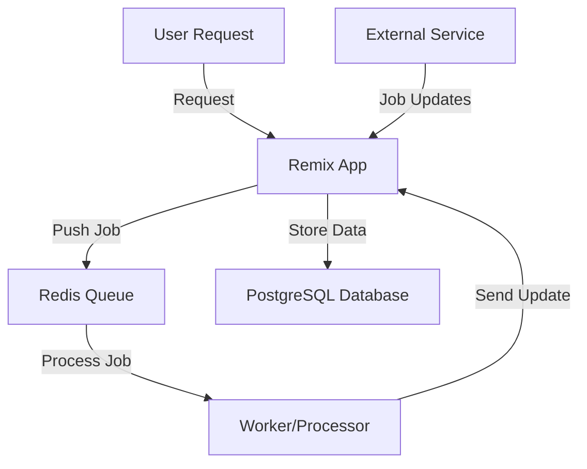

#  Iris

Essential scripts for development and deployment. A modern web application built with cutting-edge technologies.
## ⭐ Support Us

[](https://github.com/iris-connect/iris)

Please consider starring our repository to show your support!

## 💬 Join Our Community

[](https://discord.gg/uuNbJQyw6g)

Join our Discord community to:
- Get help and support
- Share your feedback and ideas
- Connect with other Iris users
- Stay updated on latest developments

## 🌟 Built With

[](https://zenstack.dev)  
[](https://remix.run)  
[](https://prisma.io)


## 📋 Prerequisites

- Node.js v18+
- pnpm 8.x
- Docker 20.x+
- PostgreSQL 14+
- Environment Configuration:  
  Create a `.env` file in the root directory using the `.env.template` file as a reference.  
  Replace all placeholder values with your actual credentials and configurations.  
  **Never commit sensitive data to version control.**

## 🛠️ Installation
```bash
pnpm run init
```
Sets up the complete environment including:
- Dependency installation
- Docker container initialization
- Database schema synchronization
- Seed data population

## 🚦 Usage

### Development Workflow
```bash
pnpm run dev    # Start development server with hot-reload
pnpm run debug  # Launch application debugger
```

### Production Deployment
```bash
pnpm run build  # Create optimized production build
pnpm run start  # Start production server (port 8099)
```

### Database Management
```bash
# Schema synchronization
pnpm run database:sync:dev  # Dev environment (destructive)

# Data operations
pnpm run database:reset     # Full reset + reseed
pnpm run database:seed      # Populate mock data
```

### Code Quality
```bash
pnpm run check   # TypeScript & model validation
pnpm run format  # Code formatting (Prettier)
pnpm run lint    # Linting (ESLint)
```

### Advanced Tools
```bash
pnpm run crud:sync       # Regenerate CRUD operations
pnpm run products:init   # Initialize Stripe integration
pnpm run docker:init     # Start Docker services
```


### Architecture


## 🗺 Roadmap

- [ ] Video test generation implementation [Generate tests from video recordings]
- [ ] Integration of open-source models for private deployments [Run tests without having to depend on openai / claude models]
- [ ] Test caching system for CI/CD optimization [If a test has been run earlier, we should cache it for faster successive executions]
- [ ] Full CI/CD pipeline implementation
- [ ] Mobile testing support (iOS/Android)
- [ ] Multi-cloud deployment configurations

## 💡 Tips

❗ Always use `pnpm run <script>` format for commands  
✅ Run `pnpm run format` before committing code  
🔧 Use `database:sync:dev` only in development environments

---

**Contribution Guidelines**: Coming soon!  
**License**: [MIT](https://opensource.org/licenses/MIT)
